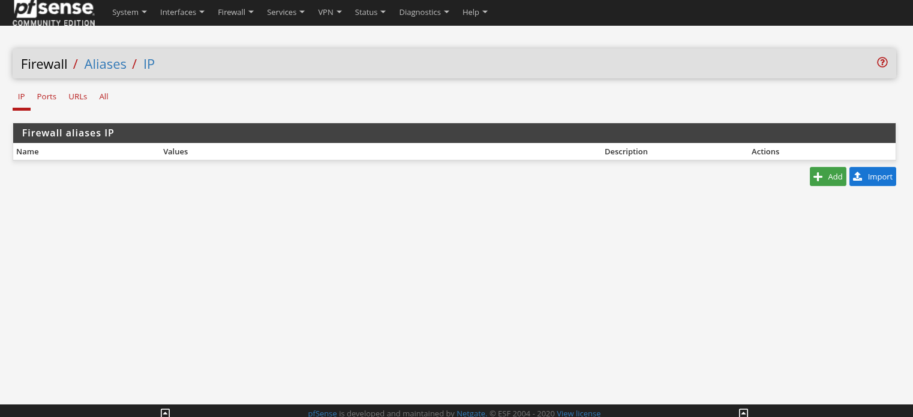
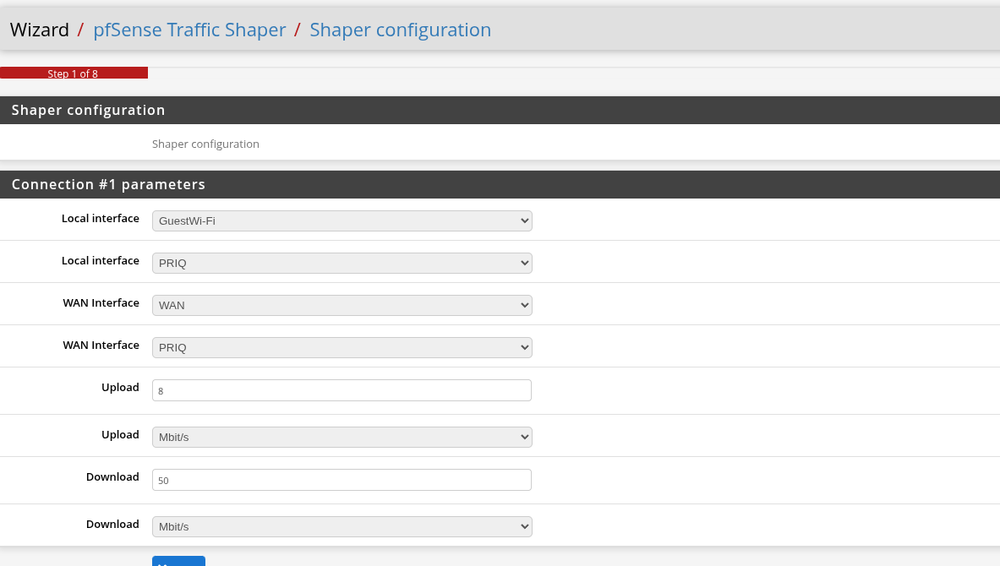

We're gonna make an alias for 2 IP addresses.

Name an alias HighBW, and add 2 IP addresses (that you wish to be prioritized) 

Go to traffic shaper --> Wizard. and configure the shaper. I'm going to select GuestWIFI for the inteface.

I want to prioritize VoIP traffic. so enable that, i set the connecttion parameters to 10 Mbits U/L and 20 Mbits D/L.

Then, I'll prioritize some networking protocols like; MSRDP, VNC PPTP and IPSec over other networking protocols.

Next, I want to do a floating rule and change the outbound port for MSRDP, convert it to 3391. 

