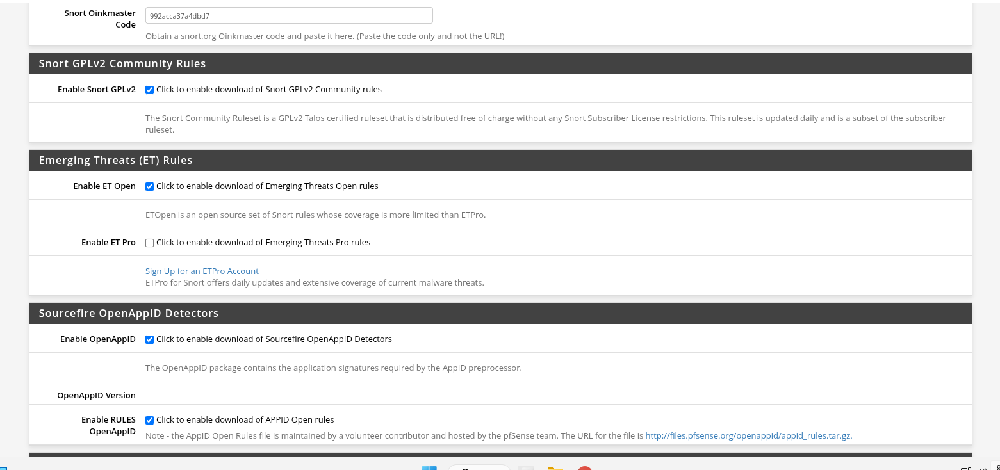
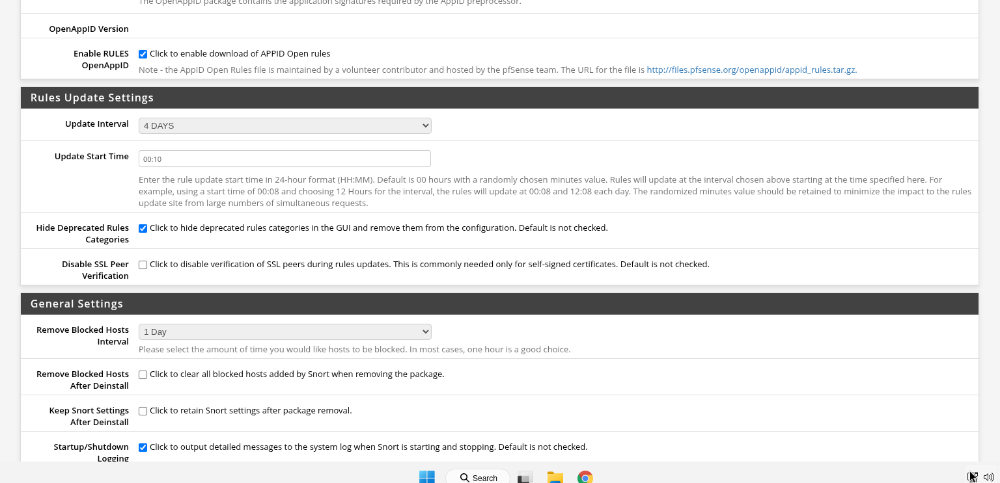

## Configuring Snort IPS via Pfsense (WAN Interface)
* Configured Snort Oinkmaster code
* Emerging Threats Open Rules
* Sourcefire OpenAPPID Detectors
* APPID Open Rules

<h1>Snort IPS Configuration on pfSense</h1>

<h1>Snort IPS Configuration on pfSense</h1>

<h1>Snort IPS Configuration on pfSense</h1>
