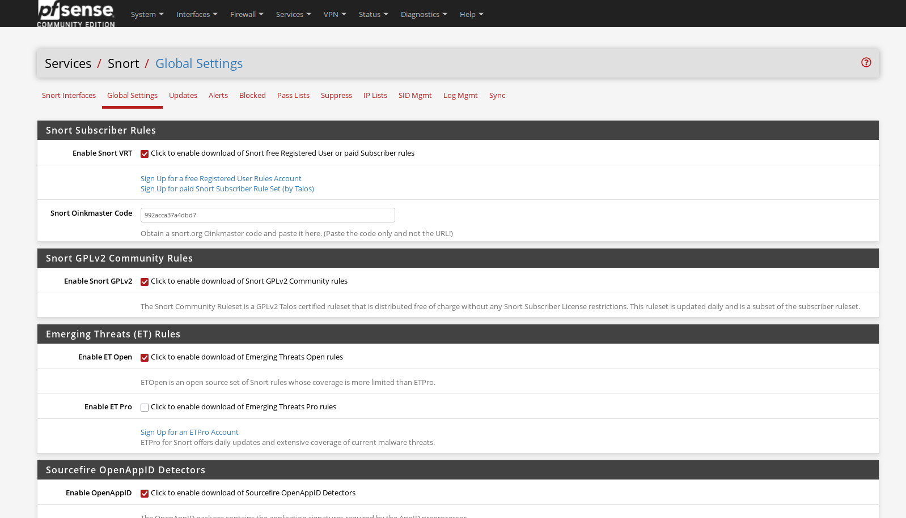
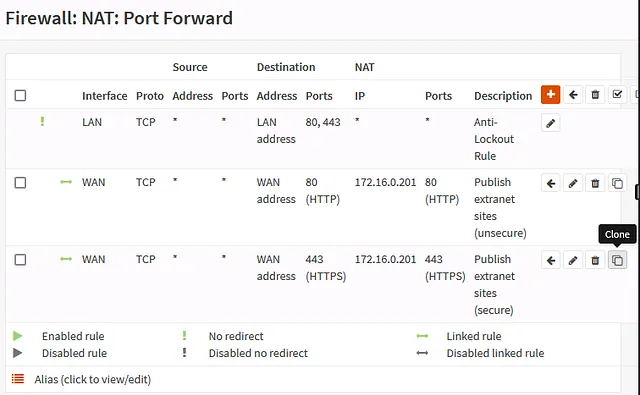
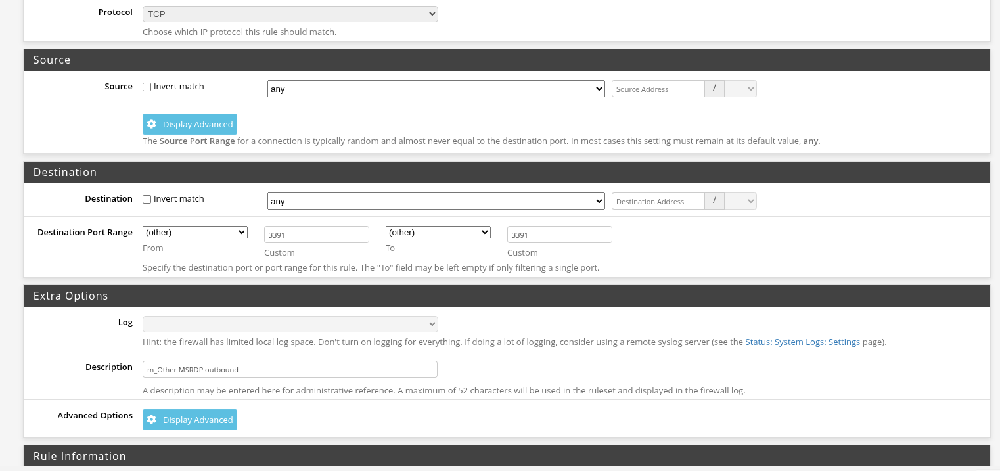

# Projects

A collection of enterprise-focused networking and cybersecurity labs built through simulation and virtualization tools such as Cisco Packet Tracer
This portfolio demonstrates practical skills in network design, routing protocols (OSPF), switching (VLANs, LACP), network services (DHCP), VPN security, and virtualized infrastructure. Each project is designed to reflect real-world enterprise environments and security practices.

## Foundation

<table>
  <tr>
    <td></td>
    <td>
      <h1>Logical Segmentation</h1>
      
VLAN + Trunking

    </td>
  </tr>
</table>

<table>
  <tr>
    <td></td>
    <td>
      <h1>DHCP Server</h1>
      
Distributing IP address across different subnets

    </td>
  </tr>
</table>

<table>
  <tr>
    <td></td>
    <td>
      <h1>SSL VPN</h1>
      
Securing 2 endpoints w/ PSK

    </td>
  </tr>
</table>

## On-Premises

<table>
  <tr>
    <td></td>
    <td>
      <h1>SOHO Network</h1>
      
SOHO Network with 4g/3g Connections and IoT Devices.

    </td>
  </tr>
</table>

<table>
  <tr>
    <td></td>
    <td>
      <h1>Enterprise Network Design #1 (HOSPITAL ENTERPRISE BASED)</h1>
      
Enterprise Design network. IPsec, OSPF, LACP, HSRP, VLANs, DHCP and VOIP

    </td>
  </tr>
</table>

## Virtualized

# Other Configs

<table>
  <tr>
    <td></td>
    <td>
      <h1>Snort-IPS configuration on Pfsense</h1>
      
Features Toggled; Oinkmater code, Snort GPLv2, APPID Open Rules, Sourcefire OpenAPPID Detectors and Emerging Threats Open Rules

    </td>
  </tr>
</table>

<table>
  <tr>
    <td></td>
    <td>
      <h1>Configuring a Jump-Box Server </h1>
      
Features;  <li>SSH Public Key Authentication</li>
  <li>Password Authentication Disabled</li>
  <li>Root SSH Login Disabled</li>
  <li>SSH Jump Server Configured</li>
  <li>SSH Agent Forwarding Disabled</li>
  <li>TCP Forwarding Enabled</li>
  <li>X11 Forwarding Disabled</li>
  <li>SSH User Restrictions Enabled</li>
  <li>UFW Firewall Enabled</li>
  <li>SSH Access Restricted to Jump Server</li>
  <li>NAT Port Forwarding for External SSH Access</li>
  <li>Jump Server Hardening Applied</li>

    </td>
  </tr>
</table>

<table>
  <tr>
    <td>
      
    </td>
    <td>
      <h1>Configuring QoS-GUI-PFsense</h1>
        
Features;      <li>Firewall Alias</li>
        <li>Traffic Shaping for Open WIFI</li>
        <li>QoS for VoIP traffic, connection parameters to U/L and D/L</li>
        <li>Prioritization to certain networking protocols;</li>
        MSRDP, VNC, PPTP and IPsec.</li>
        <li>Configuring a floating rule, change the outbound port for MSRDP.</li>

    </td>
  </tr>
</table>
